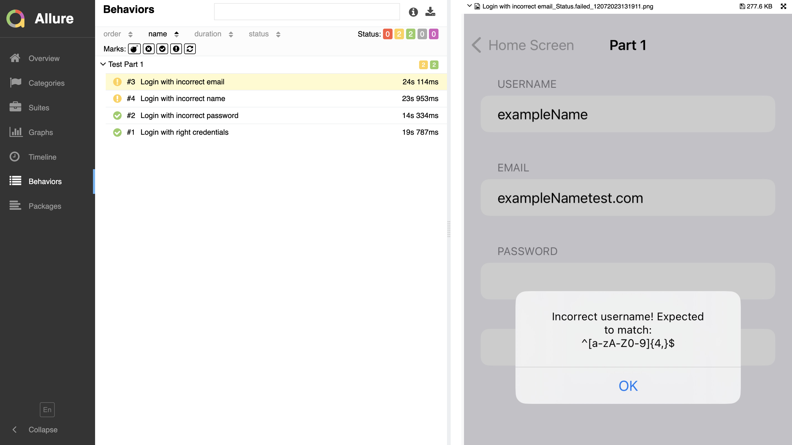

# py-testui-cvpom-example
## Getting started
Create a virtual environment:

```bash
python3 -m venv ./venv
```

Activate the venv

```bash
source ./venv/bin/activate
```

Install requirements

```bash
python3 -m pip install -r requirements.txt
```

also, for the reporting, you will have to install [Allure command line](https://allurereport.org/docs/install/)

### Main Dependencies
- Appium-Python-Client: `python -m pip install git+https://github.com/testdevlab/Py-TestUI@master`
- Behave BDD: `python -m pip install behave`
- Allure-Behave: `python -m pip install allure-behave`
- CV POM: `pip install cv_pom` check CV POM here: https://github.com/testdevlab/cv_pom

### Capabilities
Appium uses [capabilities](https://appium.io/docs/en/latest/guides/caps/) to specify webdriver settings.
Most of the capabilities are specified under the hood in the `features/environment.py`, others you need to specify.
- UDID - specification of the execution device/emulator

## Run the cases
In project's root directory type in terminal this command to run the test:
```bash
cd examples/py-testui-bdd
python -m behave features/smoke.feature
```

To start test and get the report after it type
```bash
python -m behave -f allure_behave.formatter:AllureFormatter -o ./features/artifacts/reports ./features
```

### Custom Model

You can train your custom model to predict something of your own page, and in that case, once you generate the .pt model, you can use it by generating a new CVPOMDriver in environment.py file:

        context.cv_pom_driver = TestUICVPOMDriver("./resources/best.pt", context.driver)

you can access the methods like:

<pre>
    context.cv_pom_driver.element(query).click()
    context.cv_pom_driver.element(query).send_keys(text)
    ...
</pre>

check here: https://github.com/testdevlab/cv_pom/tree/main?tab=readme-ov-file#cvpom-usage


## Test model: Debugging

To test specific model performance, you can use:

```bash
python test_model.py --model features/utils/login.pt --record ./
```

But first substitute the model path with the one you want to test!


`--record ./` is used if you want to save each image for later training with those

### After test
When the test would be finished, in the `features/artifacts` folder you can find screenshots for the successfully executed scenarios.

**If you have chosen an option with generating report:**
In the `features/artifacts/reports` folder, you can find an Allure report in JSON format.

If you want to open in the `html` format, just type
```bash
allure serve ./features/artifacts/reports
```

Note: Remember that `artifacts` folder (including screenshots and reports) would be cleared automatically when the next test run starts.

### Screenshot
